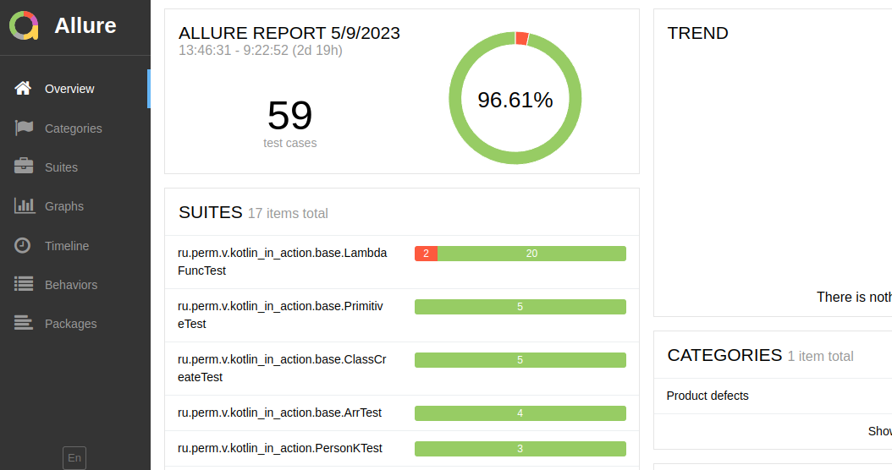

## Kotlin in action

#### Настройка

````shell
$ java -version
openjdk version "11.0.18" 2023-01-17
OpenJDK Runtime Environment (build 11.0.18+10-post-Ubuntu-0ubuntu118.04.1)
OpenJDK 64-Bit Server VM (build 11.0.18+10-post-Ubuntu-0ubuntu118.04.1, mixed mode, sharing)
````

#### Тесты

```shell
./gradlew test
```

Запуск конкретного теста из командной строки

```shell
./gradlew test --tests=ClassCreateTest
```

Перезапуск тестов с очисткой

```shell
./gradlew clean test
```

#### Подключен Allure Report

Просмотр результатов:

```shell
./allure serve build/allure-results
```
Или так
```shell
./build/allure/commandline/bin/allure serve build/allure-rests/
```
Результаты тестов в Allure



#### Запуск

```shell
./gradlew bootRun
```

### Примечания

Делегаты в kotlin:
[ru.perm.v.kotlin_in_action.base.DelegateCarTest](https://github.com/cherepakhin/kotlin_in_action/blob/master/src/test/kotlin/ru/perm/v/kotlin_in_action/base/DelegateCarTest.kt)
